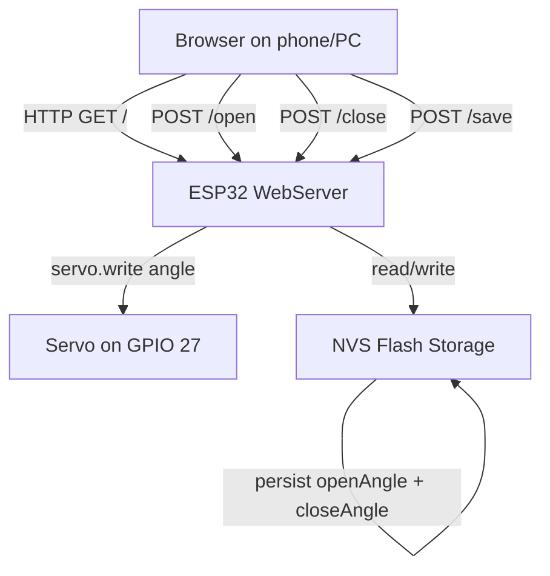

# ESP32 Camera Shutter Controller — Implementation Plan

## Overview

Replace the current sweep-test firmware with a full web-controlled servo shutter system. The ESP32 hosts a web page where the user can set open/closed angles, save them persistently, and trigger the servo.

## Architecture



## Key Design Decisions

| Decision | Choice | Rationale |
|---|---|---|
| Web server library | `WebServer` built into ESP32 Arduino core | No extra dependency, lightweight |
| Persistence | `Preferences` NVS key-value store | Built-in, reliable, simple API |
| HTML delivery | Embedded raw string in `main.cpp` | Single-file deploy, no SPIFFS partition hassle |
| WiFi config | Hardcoded SSID/password constants at top of file | Simplest for a personal project |
| Frontend | Vanilla HTML/CSS/JS with fetch API | No build tools, no framework overhead |

## Libraries Required

All are **built into the ESP32 Arduino core** — no new `lib_deps` needed:

- `WiFi.h` — Station mode connection
- `WebServer.h` — HTTP server on port 80
- `Preferences.h` — NVS flash key/value storage
- `ESP32Servo.h` — already in `platformio.ini`

**`platformio.ini` needs no changes.**

## File Structure

Only one source file will be modified:

- [`src/main.cpp`](src/main.cpp) — complete rewrite

## Detailed Implementation — `src/main.cpp`

### 1. Configuration Constants

```
SERVO_PIN     = 27        // GPIO pin
DEFAULT_OPEN  = 106       // default open angle
DEFAULT_CLOSE = 74        // default closed angle
WIFI_SSID     = "..."     // user fills in
WIFI_PASS     = "..."     // user fills in
```

### 2. Global Objects

- `Servo servo` — servo instance
- `WebServer server(80)` — HTTP server
- `Preferences prefs` — NVS storage
- `int openAngle`, `int closeAngle` — loaded from NVS on boot

### 3. `setup()`

1. Start Serial at 115200
2. Attach servo to pin 27 (500–2400 µs, 50 Hz)
3. Open NVS namespace `"shutter"`, load `openAngle` / `closeAngle` (fall back to defaults)
4. Connect WiFi in station mode, print IP to Serial
5. Define HTTP routes
6. Start web server
7. Move servo to `closeAngle` as starting position

### 4. HTTP Routes

| Route | Method | Action |
|---|---|---|
| `/` | GET | Serve the HTML page |
| `/open` | POST | Move servo to `openAngle`, return JSON status |
| `/close` | POST | Move servo to `closeAngle`, return JSON status |
| `/save` | POST | Read `openAngle`/`closeAngle` from request body, save to NVS, return JSON status |

### 5. Web Interface — Single Page HTML

A clean, mobile-friendly page with:

- **Title**: "Camera Shutter Controller"
- **Status line**: shows current servo position (Open / Closed) and the ESP32 IP
- **Angle inputs**: two number fields — one for Open angle, one for Close angle (pre-filled from current saved values)
- **Save button**: persists the angle values to flash
- **Open button**: moves servo to the open angle
- **Close button**: moves servo to the close angle

The page uses inline CSS for a clean look (large touch-friendly buttons, responsive layout). JavaScript uses `fetch()` for all actions so the page never reloads — the status updates dynamically.

### 6. `loop()`

Single call: `server.handleClient()` — keeps the web server responsive.

## Web UI Mockup

```
┌──────────────────────────────┐
│   Camera Shutter Controller  │
│                              │
│   Status: CLOSED  (74°)      │
│                              │
│   ┌──────────────────────┐   │
│   │ Open angle:  [ 106 ] │   │
│   │ Close angle: [ 74  ] │   │
│   └──────────────────────┘   │
│                              │
│   [ Save Settings ]          │
│                              │
│   ┌────────┐  ┌─────────┐   │
│   │  OPEN  │  │  CLOSE  │   │
│   └────────┘  └─────────┘   │
│                              │
│   IP: 192.168.1.100         │
└──────────────────────────────┘
```

## Execution Steps

1. Confirm plan with user
2. Rewrite `src/main.cpp` with the full implementation
3. Build and verify compilation
